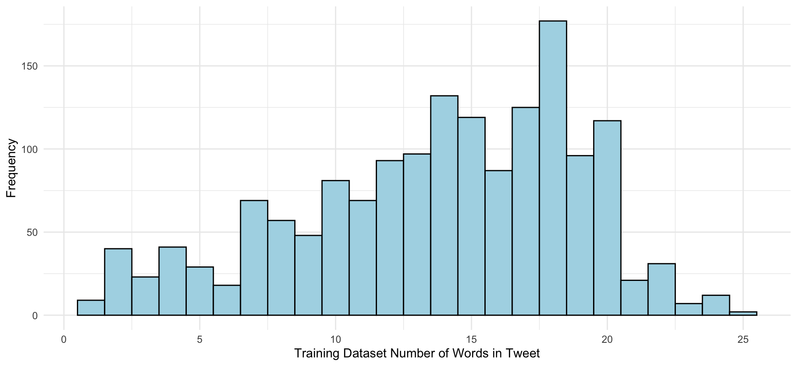
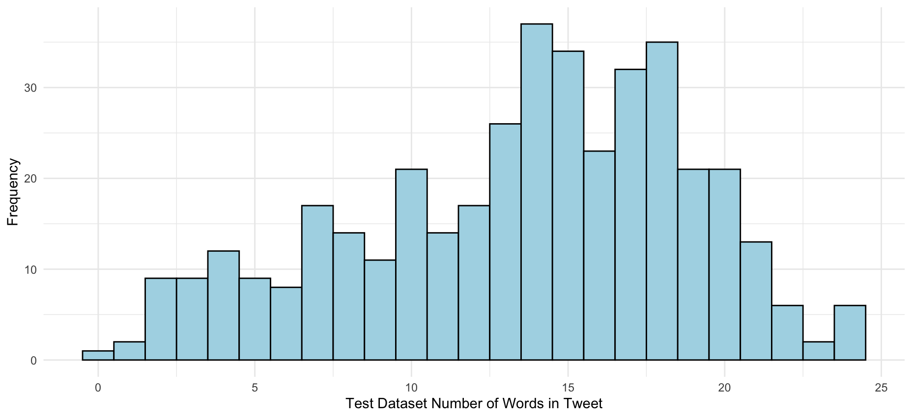
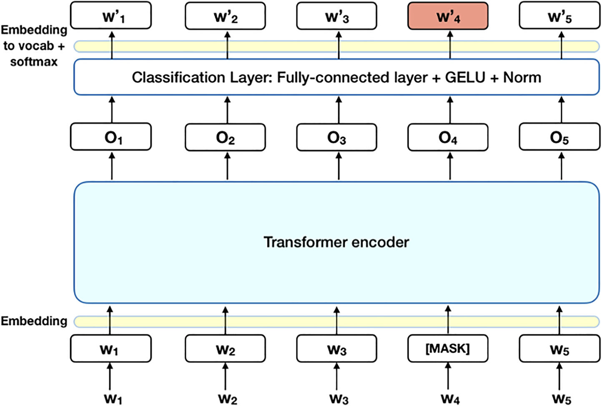
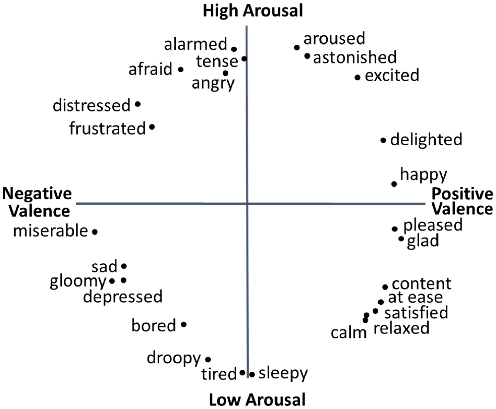
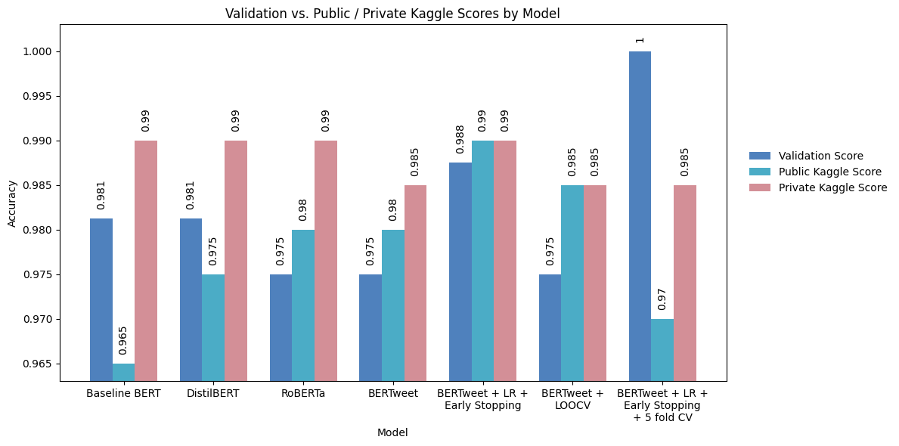
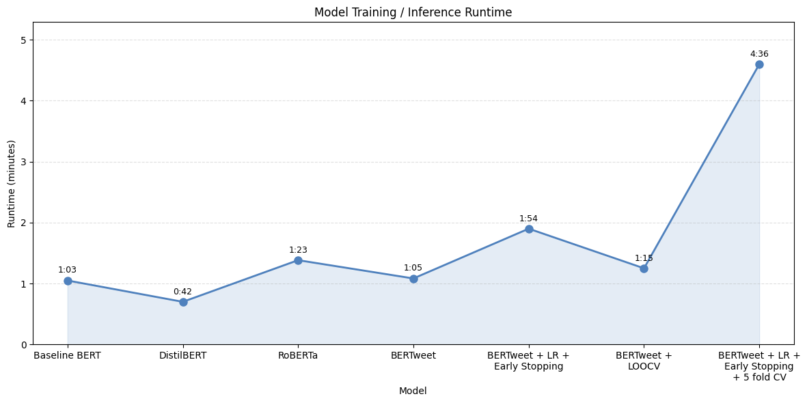

# NLP-Based Sentiment Analysis: A Deep Learning Approach Using BERT

Fine-tuning transformer models (BERT, DistilBERT, RoBERTa, BERTweet) for multi-class tweet sentiment classification. Built for the [Kaggle NLP – Sentiment Analysis XM](https://www.kaggle.com/competitions/nlp-sentiment-analysis-xm) competition, evaluated on classification accuracy.

---

## What This Project Does

Tweets are a uniquely challenging text domain — short, context-dependent, full of usernames, hashtags, and emojis, and often responding to real-world events rather than expressing self-contained opinions. This project explores how well pre-trained transformer models can be fine-tuned to classify tweet sentiment into four categories, and whether more domain-specialized models (BERTweet, pre-trained on 850M+ English tweets) outperform general-purpose ones (BERT, RoBERTa).

Seven model variants were trained and submitted, systematically layering in improvements — learning rate scheduling, early stopping, and cross-validation — to understand exactly what each addition buys you.

📄 **[Full project report](report/Project_Report.pdf)**

---

## Dataset

**Source:** [Kaggle NLP – Sentiment Analysis XM](https://www.kaggle.com/competitions/nlp-sentiment-analysis-xm)

Adapted from the [SMILE Twitter Emotion Dataset](https://doi.org/10.6084/m9.figshare.3187909.v2) — tweets primarily referencing experiences and exhibits at the British Museum.

| Split | Size | Columns |
|---|---|---|
| Train | 1,600 tweets | ID, Text, Sentiment (0–3) |
| Test | 400 tweets | ID, Text |

**Sentiment categories** (labels 0–3) roughly map onto:
- `0` — positive / happy
- `1` — negative high-arousal (angry)
- `2` — neutral
- `3` — negative low-arousal (sad)

Label distribution was roughly equal across all four categories. Tweet preprocessing (removing usernames, URLs) was tested but did not improve model performance and was omitted.

<p float="left">
  
  
</p>

*Tweet length distributions for training and test sets — similar and roughly normal, validating that test data is in-distribution.*

---

## Approach

### Architecture

All models use the HuggingFace `transformers` library with PyTorch. Each follows the same structure:



1. Tokenize text with the model's native tokenizer (`max_length=128`, truncation + padding)
2. Wrap in a custom `torch.utils.data.Dataset`
3. Fine-tune the sequence classification head with `AdamW`
4. Evaluate on a held-out 10% validation split

### Why these four models?

The sentiment categories used here map loosely onto the valence–arousal circumplex — a framework for representing emotions in a 2D space of positivity and intensity:



Tweets are noisier than typical sentiment targets (reviews, articles) because they are context-dependent and conversational. BERTweet was specifically pre-trained on Twitter data, making it a natural candidate to test against general-purpose transformers.

---

## Results

### Accuracy



| # | Model | Val Accuracy | Private Score | Public Score |
|---|---|---|---|---|
| 1 | BERT (`bert-base-uncased`) | 98.1% | 0.990 | 0.965 |
| 2 | DistilBERT (`distilbert-base-uncased`) | 98.1% | 0.990 | 0.975 |
| 3 | RoBERTa (`roberta-base`) | 97.5% | 0.990 | 0.980 |
| 4 | BERTweet (`vinai/bertweet-base`) | 97.5% | 0.985 | 0.980 |
| 5 | **BERTweet + LR Scheduler + Early Stopping** | **98.75%** | **0.990** | **0.990** |
| 6 | BERTweet + LOOCV | 97.5% | 0.985 | 0.985 |
| 7 | BERTweet + LR + Early Stopping + 5-Fold CV | 100% | 0.985 | 0.970 |

All models trained on Google Colab with T4 GPU.

**Best submission:** Model 5 — BERTweet with linear LR scheduling and early stopping achieved **0.99 on both private and public leaderboard**.

### Runtime



DistilBERT (42s) ran in under half the time of BERT (1m 3s) with identical accuracy — the strongest efficiency-to-performance ratio of all models tested. Model 7's 5-fold CV ran 4m 36s and overfit, scoring lower on the leaderboard despite 100% validation accuracy.

---

## Key Findings

- **Domain matters, but not as much as tuning:** BERTweet (Twitter-native) didn't automatically outperform BERT — it needed LR scheduling and early stopping to pull ahead. Raw fine-tuning alone gave similar results across all four architectures.
- **LR scheduling + early stopping was the decisive improvement:** Adding a linear warmup/decay schedule and early stopping to BERTweet was the single change that achieved the best leaderboard result (0.99/0.99).
- **Overfitting with 5-fold CV:** Model 7 hit 100% validation accuracy but scored lower on the public leaderboard (0.97) — the CV stacking overfit to the training distribution.
- **No preprocessing needed:** Removing usernames and URLs from tweets didn't improve performance. The models learned to handle Twitter-specific noise from their pre-training data.
- **DistilBERT is the efficiency winner:** 40% faster than BERT with identical accuracy — strong choice for production or resource-constrained settings.

---

## Project Structure

```
.
├── NLP_Sentiment_Analysis_BERT.ipynb   # Full pipeline: data loading → models → submissions
├── report/
│   └── Project_Report.pdf             # Full written report with methods and analysis
├── data/
│   ├── train.csv
│   ├── test_features.csv
│   └── sample_submission.csv
├── figures/
│   ├── bert_architecture.png
│   ├── emotion_circumplex.png
│   ├── tweet_length_train.png
│   ├── tweet_length_test.png
│   ├── model_accuracy_comparison.png
│   └── model_runtime.png
└── requirements.txt
```

---

## Setup

```bash
pip install -r requirements.txt
jupyter notebook NLP_Sentiment_Analysis_BERT.ipynb
```

> **Note:** Originally developed in Google Colab with a T4 GPU. Update data file paths from `/content/` to `data/` when running locally. GPU is strongly recommended — CPU training will be significantly slower.

---

## Authors

Shilpa Sundar · Mags McAllister
